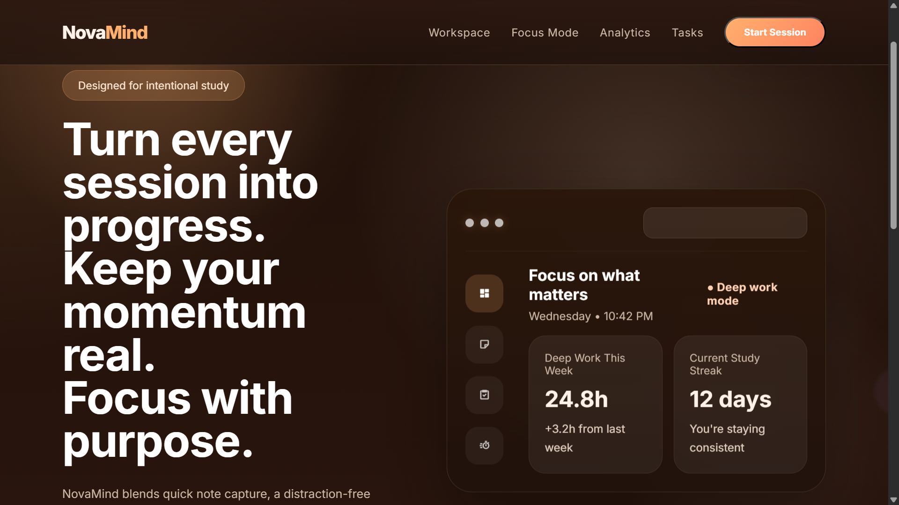
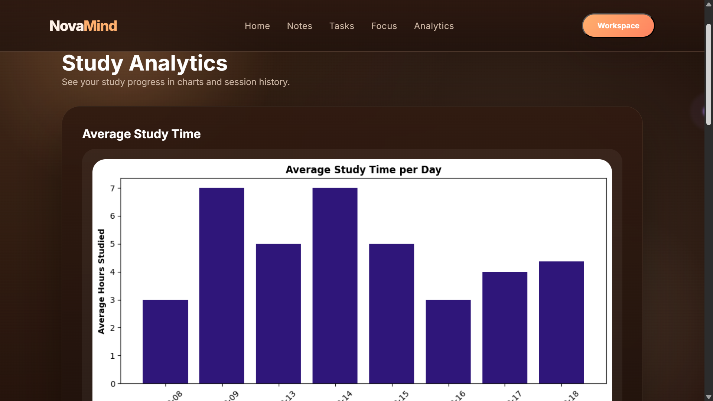
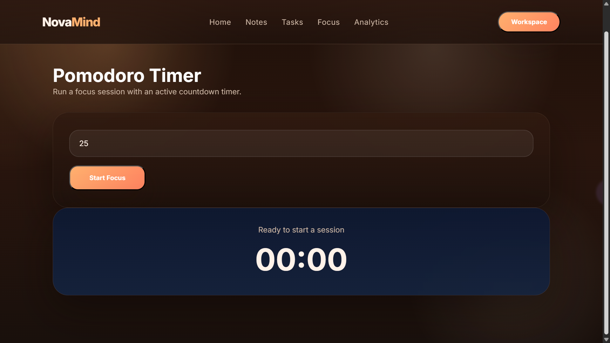
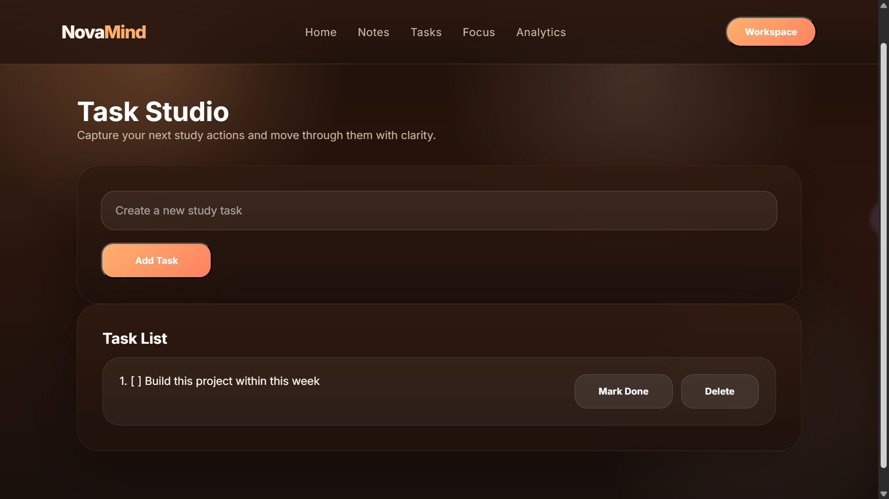
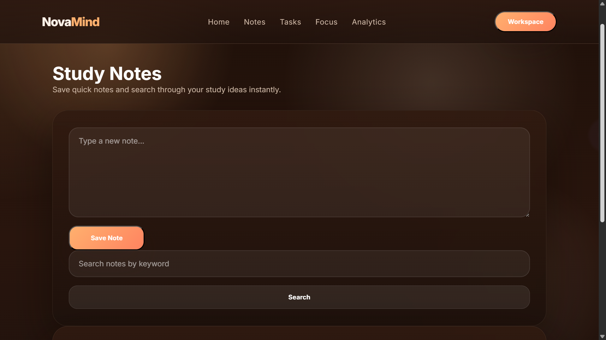

<div align="center">

<<<<<<< HEAD
<h1>🧠 NovaMind</h1>
<h3>Smart Study Productivity Platform</h3>

<p>A full-stack student productivity platform that combines smart notes, task management, Pomodoro focus sessions, study analytics, and a gamified achievement system — all in one immersive digital workspace.</p>


</div>

---

## 📖 Table of Contents

- [Overview](#-overview)
- [Features](#-features)
- [Tech Stack](#️-tech-stack)
- [Project Structure](#-project-structure)
- [Database Schema](#-database-schema)
- [API Reference](#-api-reference)
- [Getting Started](#-getting-started)
- [Environment Variables](#-environment-variables)
- [Achievement System](#-achievement-system)
- [UI/UX Design](#-uiux-design)
- [Roadmap](#-roadmap)
- [Author](#-author)

---

## 🌟 Overview

NovaMind transforms the traditional student productivity experience into a modern, immersive workspace. Rather than juggling multiple apps, students get a single, cohesive platform with:

- 🔐 **Secure user accounts** powered by Supabase Auth + JWT sessions
- 📝 **Smart Notes** with keyword-based search
- ✅ **Task Management** with real-time completion tracking
- 🍅 **Pomodoro Timer** for deep-focus study sessions
- 📊 **Visual Analytics** with auto-generated study charts
- 🏆 **Gamified Achievements** to keep motivation high

All data is **user-specific and persisted** to Supabase (PostgreSQL), so nothing is lost between sessions.
=======
# 🧠 NovaMind
### *Your Second Brain for Studying*

**📚 Study smarter. • ⏳ Focus deeper. • 📈 Track consistency. • 🚀 Build unstoppable momentum.**

---

NovaMind is a modern productivity platform built for students who want more than just a boring notes app. It transforms studying into an immersive digital workspace combining smart notes, deep-focus Pomodoro sessions, analytics dashboards, productivity workflows, and consistency tracking into one beautiful and distraction-free experience.

</div>

---

# ⚡ Why NovaMind Exists

Most study apps feel:
* ❌ Outdated
* ❌ Cluttered
* ❌ Overwhelming
* ❌ Painfully boring

NovaMind was built to feel different. Instead of creating another basic CRUD project, the goal was to build a productivity platform that actually feels motivating to use.

> ### 💡 The Inspiration
> Something that feels like a seamless combination of **Notion × Forest × Todoist × Linear**, but designed specifically for students.

---

# ✨ What Makes NovaMind Different?

<table>
<tr>
<td width="50%" valign="top">

### 🎨 Modern Product Design
* 🚀 **Startup-inspired UI/UX:** Built with modern user-flows.
* 🧊 **Glassmorphism Interface:** Aesthetic, clean, and modern transparency.
* 🪄 **Smooth Animations:** Fluid transitions that enhance the experience.
* 📱 **Responsive Layouts:** Designed to adapt beautifully.

</td>
<td width="50%" valign="top">

### 📊 Productivity Experience
* 📈 **Analytics Dashboard:** Beautiful visual data tracking.
* ⏱️ **Session Tracking:** Monitor your focus blocks perfectly.
* 🎯 **Deep-Focus Workflows:** Minimize distractions instantly.
* 🧠 **Consistency Insights:** Understand your study habits over time.

</td>
</tr>
</table>

### ⚙️ Built Like a Real Product
NovaMind was designed with:
* **Clean separation:** Structured frontend/backend boundary.
* **Scalable architecture:** Robust Flask backend implementation.
* **Interactive tools:** Dynamic dashboards and workflows.
* **Immersive design:** A productivity-focused aesthetic that eliminates friction.

Instead of feeling like a typical student project, the goal was to build something that feels closer to a modern startup MVP.

---

# 🧩 Core Features

* ### 📚 Smart Notes Workspace
  Capture, search, and organize study notes in a distraction-free environment.
* ### ✅ Productivity Task System
  Manage study goals, complete tasks, and stay consistent every day.
* ### ⏳ Deep Focus Pomodoro
  Built-in focus timer designed to encourage uninterrupted study sessions.
* ### 📊 Study Analytics Dashboard
  Visualize productivity trends, study sessions, and consistency insights.
* ### 📝 Session Logging System
  Track daily study hours and build measurable study momentum.

---

# 🎨 UI/UX Philosophy

NovaMind focuses heavily on visual clarity, immersive workflows, smooth interactions, and modern productivity aesthetics. 

Inspired by products like **Notion, Forest, Linear, Studyverse, and Todoist**, the interface was designed to feel calm, focused, and premium.

---

# 📸 Screenshots

### 🏠 Landing Page


---

### 📊 Analytics Dashboard


---

### ⏳ Pomodoro Workspace


---

### ✅ Task Manager


---

### 📝 Notes Workspace

>>>>>>> aab29c83cf1a85d3a6d1d7978c7b52f0924f4275

---

## ✨ Features

<<<<<<< HEAD
### 🔐 Authentication System
- Email/password signup and login via **Supabase Auth**
- JWT access tokens stored securely in **Flask server-side sessions**
- `@login_required` decorator protects all API routes
- Auto-redirect to login page for unauthenticated access
- Graceful logout with session clearing

### 📝 Smart Notes
- Create, view, search, and delete study notes
- **Fuzzy keyword search** powered by RapidFuzz
- NLP-enhanced processing with spaCy
- Notes are user-scoped — no data leakage between accounts

### ✅ Task Management
- Add tasks with a single click
- Toggle tasks between **pending** and **done**
- Delete completed tasks
- Achievement triggers fire on task milestones

### 🍅 Pomodoro Focus Timer
- Configurable session duration (default: 25 min)
- Live browser countdown timer
- Sessions are saved to Supabase on completion
- View total sessions and focus stats on the dashboard

### 📊 Study Progress Tracker
- Log daily study hours with date tracking
- Auto-generates a **Matplotlib chart** of average study time
- Session history sorted by most recent
- Tracks targets and averages over time

### 🏆 Achievement System
- 10 unique achievements across 4 categories
- Automatically awarded as milestones are reached
- Progress tracking toward next achievement unlocks
=======
| Layer | Technology |
| :--- | :--- |
| **Frontend** | `HTML5` • `CSS3` • `JavaScript` |
| **Backend** | `Python` • `Flask` |
| **Libraries** | `Matplotlib` • `spaCy` • `RapidFuzz` |
>>>>>>> aab29c83cf1a85d3a6d1d7978c7b52f0924f4275

---

## 🛠️ Tech Stack

<<<<<<< HEAD
| Layer | Technology |
|---|---|
| **Backend Framework** | Flask (Python) |
| **Database** | Supabase (PostgreSQL) |
| **Authentication** | Supabase Auth + JWT |
| **ORM / DB Client** | supabase-py |
| **NLP** | spaCy |
| **Fuzzy Search** | RapidFuzz |
| **Charts** | Matplotlib |
| **Frontend** | HTML5, CSS3, Vanilla JavaScript |
| **Styling** | Custom CSS (Glassmorphism + Dark Theme) |
| **Config** | python-dotenv |

---

## 📂 Project Structure

```
study_buddy/
│
├── backend/
│   ├── app.py                     # Flask app — all routes & API endpoints
│   ├── auth_service.py            # Supabase Auth, JWT & session management
│   ├── supabase_client.py         # Supabase client initialization
│   ├── notes.py                   # Notes CRUD (add, view, search, delete)
│   ├── tasks.py                   # Task management (add, toggle, delete)
│   ├── pomodoro.py                # Pomodoro timer logic & session storage
│   ├── study_progress_tracker.py  # Study session logging & chart generation
│   ├── achievements.py            # Achievement definitions & award logic
│   ├── quiz_app.py                # Quiz feature module
│   ├── todolist.py                # Legacy to-do list module
│   ├── .env                       # Environment variables (not committed)
│   └── requirements.txt           # Backend dependencies
=======
```bash
STUDY_BUDDY/
├── backend/
│   ├── app.py
│   ├── notes.py
│   ├── tasks.py
│   ├── pomodoro.py
│   └── study_progress_tracker.py
>>>>>>> aab29c83cf1a85d3a6d1d7978c7b52f0924f4275
│
├── frontend/
│   ├── templates/
│   │   ├── index.html             # Main dashboard
│   │   ├── login.html             # Login page
│   │   ├── signup.html            # Signup page
│   │   ├── notes.html             # Notes UI
│   │   ├── tasks.html             # Task manager UI
│   │   ├── pomodoro.html          # Pomodoro timer UI
│   │   ├── progress.html          # Study analytics dashboard
│   │   └── progress_log.html      # Log study session UI
│   └── static/
│       ├── style.css              # Main stylesheet (glassmorphism dark theme)
│       ├── animations.css         # Micro-animations & transitions
│       ├── main.js                # Core frontend logic (all modules)
│       └── auth.js                # Frontend auth flow handling
│
├── requirements.txt               # Project-level dependencies
└── README.md
```

---

## 🗄️ Database Schema

<<<<<<< HEAD
NovaMind uses **Supabase (PostgreSQL)** with the following tables:

### `users`
| Column | Type | Description |
|--------|------|-------------|
| `id` | UUID | Primary key (from Supabase Auth) |
| `username` | TEXT | Display name |
| `email` | TEXT | User email |

### `notes`
| Column | Type | Description |
|--------|------|-------------|
| `id` | UUID | Primary key |
| `user_id` | UUID | Foreign key → users |
| `content` | TEXT | Note body |
| `created_at` | TIMESTAMP | Creation time |

### `tasks`
| Column | Type | Description |
|--------|------|-------------|
| `id` | UUID | Primary key |
| `user_id` | UUID | Foreign key → users |
| `title` | TEXT | Task description |
| `status` | TEXT | `pending` or `done` |
| `created_at` | TIMESTAMP | Creation time |

### `study_sessions`
| Column | Type | Description |
|--------|------|-------------|
| `id` | UUID | Primary key |
| `user_id` | UUID | Foreign key → users |
| `date` | DATE | Study date |
| `hours` | FLOAT | Hours studied |

### `pomodoro_sessions`
| Column | Type | Description |
|--------|------|-------------|
| `id` | UUID | Primary key |
| `user_id` | UUID | Foreign key → users |
| `duration_minutes` | INT | Session duration |
| `completed_at` | TIMESTAMP | Completion time |

### `achievements`
| Column | Type | Description |
|--------|------|-------------|
| `id` | UUID | Primary key |
| `user_id` | UUID | Foreign key → users |
| `type` | TEXT | Achievement key (e.g. `first_note`) |
| `earned_at` | TIMESTAMP | When it was awarded |

---

## 📡 API Reference

All protected endpoints require an active session (login first).

### 🔑 Authentication

| Method | Endpoint | Description |
|--------|----------|-------------|
| `POST` | `/api/auth/signup` | Register a new account |
| `POST` | `/api/auth/login` | Login with email & password |
| `POST` | `/api/auth/logout` | Logout and clear session |
| `GET` | `/api/auth/me` | Get current user info |

**Signup Request Body:**
```json
{
  "email": "user@example.com",
  "password": "securepassword",
  "username": "Lakshya"
}
```

**Login Request Body:**
```json
{
  "email": "user@example.com",
  "password": "securepassword"
}
```

---

### 📝 Notes

| Method | Endpoint | Description |
|--------|----------|-------------|
| `GET` | `/api/notes` | Fetch all notes for current user |
| `POST` | `/api/notes/add` | Add a new note |
| `POST` | `/api/notes/search` | Search notes by keyword |
| `POST` | `/api/notes/delete` | Delete a note by number |

---

### ✅ Tasks

| Method | Endpoint | Description |
|--------|----------|-------------|
| `GET` | `/api/tasks` | Fetch all tasks for current user |
| `POST` | `/api/tasks/add` | Add a new task |
| `POST` | `/api/tasks/toggle` | Toggle task completion status |
| `POST` | `/api/tasks/delete` | Delete a task |

---

### 📊 Progress

| Method | Endpoint | Description |
|--------|----------|-------------|
| `GET` | `/api/progress` | Get all sessions + chart URL |
| `POST` | `/api/progress/log` | Log a new study session |

**Log Session Body:**
```json
{
  "date": "2026-05-28",
  "hours": 3.5
}
```

---

### 🍅 Pomodoro

| Method | Endpoint | Description |
|--------|----------|-------------|
| `POST` | `/api/pomodoro/start` | Start a pomodoro session |
| `POST` | `/api/pomodoro/complete` | Save a completed session |
| `GET` | `/api/pomodoro/stats` | Get user's pomodoro statistics |

---

### 🏆 Achievements

| Method | Endpoint | Description |
|--------|----------|-------------|
| `GET` | `/api/achievements` | Get all earned achievements |
| `GET` | `/api/achievements/progress` | Get progress toward next achievements |

---

## 🚀 Getting Started

### Prerequisites

- Python 3.10+
- A [Supabase](https://supabase.com) account (free tier is enough)
- Git

### 1. Clone the Repository
=======
Follow these simple steps to get your development environment set up locally:
>>>>>>> aab29c83cf1a85d3a6d1d7978c7b52f0924f4275

### 1. Clone Repository
```bash
git clone https://github.com/mrlakshya07/NovaMind.git
cd NovaMind
```

### 2. Create a Virtual Environment

```bash
python -m venv venv

# Windows
venv\Scripts\activate

# macOS / Linux
source venv/bin/activate
```

### 3. Install Dependencies

```bash
pip install -r requirements.txt
```

### 4. Set Up Supabase

1. Go to [supabase.com](https://supabase.com) and create a new project
2. In your project dashboard, go to **Settings → API**
3. Copy your **Project URL** and **anon/public key**
4. Create the required database tables (see [Database Schema](#-database-schema))

### 5. Configure Environment Variables

Create a `.env` file inside the `backend/` directory:

```env
SUPABASE_URL=https://your-project-id.supabase.co
SUPABASE_KEY=your-anon-public-key
SECRET_KEY=your-flask-secret-key
```

> ⚠️ Never commit `.env` to version control. It is already listed in `.gitignore`.

### 6. Run the Application

```bash
python backend/app.py
```

### 7. Open in Browser

<<<<<<< HEAD
```
=======
# 🌐 Local Server

Once running, open your browser and navigate to:

```txt
>>>>>>> aab29c83cf1a85d3a6d1d7978c7b52f0924f4275
http://127.0.0.1:5000
```

---

## 🔐 Environment Variables

<<<<<<< HEAD
| Variable | Required | Description |
|----------|----------|-------------|
| `SUPABASE_URL` | ✅ | Your Supabase project URL |
| `SUPABASE_KEY` | ✅ | Supabase anon/public API key |
| `SECRET_KEY` | ✅ | Flask session secret key (use a long random string in production) |
=======
We have big plans for NovaMind. Here is what is on the roadmap:

- [ ] 🔐 JWT Authentication
- [ ] 🗄️ PostgreSQL Database
- [ ] 🤖 AI Quiz Generator
- [ ] 🔥 Study Heatmaps
- [ ] 👤 User Profiles
- [ ] ☁️ Cloud Deployment
- [ ] 📱 Mobile Responsiveness Improvements
- [ ] 🌗 Dark/Light Theme Toggle
- [ ] 🏆 Achievement & Streak System
>>>>>>> aab29c83cf1a85d3a6d1d7978c7b52f0924f4275

---

## 🏆 Achievement System

<<<<<<< HEAD
NovaMind features a built-in achievement engine that automatically awards badges as users hit milestones.

| Achievement | Icon | Trigger |
|-------------|------|---------|
| **First Note** | 📝 | Write your first study note |
| **Note Master** | 📚 | Write 10 study notes |
| **Note Collector** | 📖 | Collect 100 study notes |
| **Task Creator** | ✓ | Create your first task |
| **Task Master** | ✔️ | Complete 10 tasks |
| **Study Starter** | 📊 | Log your first study session |
| **Consistent Scholar** | 📈 | Log 5 study sessions |
| **Pomodoro Pioneer** | 🍅 | Complete your first Pomodoro |
| **Focus Master** | 🎯 | Complete 10 Pomodoros |
| **Week Warrior** | 🔥 | Maintain a 7-day study streak |

Progress toward the next achievement in each category is tracked via `/api/achievements/progress`.
=======
NovaMind was built to transform traditional student productivity tools into a modern, immersive study experience. 

Instead of creating another basic CRUD project, the goal was to build a realistic productivity platform with a modern frontend architecture, a scalable backend structure, tight analytics integration, and a startup-inspired UI/UX.
>>>>>>> aab29c83cf1a85d3a6d1d7978c7b52f0924f4275

---

## 🎨 UI/UX Design

<<<<<<< HEAD
NovaMind's frontend is built with a **premium glassmorphism dark theme**, drawing inspiration from tools like Notion, Linear, and Todoist.

**Design Highlights:**
- 🌑 Deep dark background with glass-effect cards
- ✨ Smooth gradient accents and hover effects
- 🎞️ Micro-animations for interactive elements (see `animations.css`)
- 📱 Responsive layout for all screen sizes
- 🖋️ Modern typography with clean hierarchy

**Pages:**
| Route | Page |
|-------|------|
| `/` | Main dashboard |
| `/login` | Login page |
| `/signup` | Signup page |
| `/notes` | Notes manager |
| `/tasks` | Task list |
| `/pomodoro` | Pomodoro timer |
| `/progress` | Analytics dashboard |
| `/progress/log` | Log a study session |

---

## 🗺️ Roadmap

- [ ] AI-powered Quiz Generator from notes
- [ ] Study heatmap calendar (GitHub-style)
- [ ] Dark / Light theme toggle
- [ ] Mobile app (React Native or PWA)
- [ ] Spaced repetition flashcard system
- [ ] Friend leaderboard & social study rooms
- [ ] Email reminders & study streak notifications
- [ ] Export notes as PDF
- [ ] Cloud deployment (Render / Railway / Vercel)

---

## 🤝 Contributing

Contributions are welcome! To get started:

1. Fork the repository
2. Create a feature branch: `git checkout -b feature/your-feature-name`
3. Commit your changes: `git commit -m "feat: add your feature"`
4. Push to your branch: `git push origin feature/your-feature-name`
5. Open a Pull Request

Please follow conventional commit messages and keep PRs focused on a single feature or fix.

---

## 📄 License

This project is licensed under the **MIT License** — see the [LICENSE](LICENSE) file for details.

---

## 👨‍💻 Author

<div align="center">

**Built with ❤️ by Lakshya**

If you found this project useful or inspiring, please consider giving it a ⭐ — it really helps!

[](https://github.com/mrlakshya07)

</div>
=======
Built with 💻 by **Lakshya**

If you liked this project, consider starring the repository ⭐
>>>>>>> aab29c83cf1a85d3a6d1d7978c7b52f0924f4275
